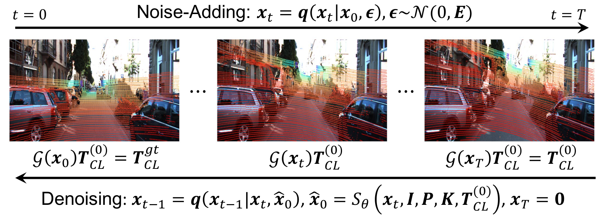

# Iterative Camera-Lidar Calibration via Surrogate Diffusion Model (IROS 2025)
* Official Implementation of Iterative Camera-Lidar Calibration via Surrogate Diffusion Models [[arxiv](https://arxiv.org/abs/2506.14706)]
* Include Unofficial Implementation of CalibNet、RGGNet、LCCNet、LCCRAFT in Pytorch 2.x, CUDA 11.7

# Comparison of iterative methods mentioned in our paper


# Dependencies
|Pytorch|CUDA|Python|
|---|---|---|
|2.0.1|11.7|3.8.17|
# Build Packages
* Check TORCH_CUDA_ARCH_LIST:
```bash
python -c "import torch; print(torch.cuda.get_device_capability())"
```
The output can be `(8, 6)` to indicate 8.6.
* Set `TORCH_CUDA_ARCH_LIST` to simplify compilation: (for example, 8.6)
```bash
export TORCH_CUDA_ARCH_LIST="8.6"
```
* Build csrc package for our method
```bash
cd models/tools/csrc/
python setup.py build_ext --inplace
```
* Build correlation_cuda package for LCCNet
```bash
cd models/lccnet/correlation_package/
python setup.py build_ext --inplace
```
* Install pointnet2_ops
```bash
pip install "git+https://github.com/erikwijmans/Pointnet2_PyTorch.git#egg=pointnet2_ops&subdirectory=pointnet2_ops_lib"
```
* Install GPU KNN
```bash
pip install --upgrade https://github.com/unlimblue/KNN_CUDA/releases/download/0.2/KNN_CUDA-0.2-py3-none-any.whl
```
* Third-party Libraries
```bash
pip install -r requirements.txt
```
<details>
  <summary>Troubleshooting</summary>
  The `correlation_cuda` package may be incompatible with CUDA >= 12.0. The failure of building this package only affects implementation of our baseline, LCCNet. If you have CUDA >= 12.0 and still want to implement LCCNET, it would be easy to use correlation pacakge in csrc to re-implement it. To try our best to reproduce LCCNet's performance, we utilize their own correlation package.
</details>

# Link KITTI Dataset to the root
* download KITTI dataset from [https://www.cvlibs.net/datasets/kitti/eval_odometry.php](https://www.cvlibs.net/datasets/kitti/eval_odometry.php). (RGB, Veloydne and Calib data are all required)
* link the `dataset` filefolder as follows:
```bash
mkdir data
cd data
ln -s /path/to/kitti/ kitti
cd ..
```
# Link Nuscenes Dataset to the root
* download nuscenes dataset from [https://www.nuscenes.org/nuscenes#download](https://www.nuscenes.org/nuscenes#download). (v1.0-full, download keyframes of the trainval part and the test part)
* The files you download are:
```                  
v1.0-test_blobs.tgz            v1.0-trainval06_keyframes.tgz
v1.0-test_meta.tgz             v1.0-trainval07_keyframes.tgz
v1.0-trainval01_keyframes.tgz  v1.0-trainval08_keyframes.tgz
v1.0-trainval02_keyframes.tgz  v1.0-trainval09_keyframes.tgz
v1.0-trainval03_keyframes.tgz  v1.0-trainval10_keyframes.tgz
v1.0-trainval04_keyframes.tgz  v1.0-trainval_meta.tgz
v1.0-trainval05_keyframes.tgz
```
* unzip files naemd `v1-*.tgz` to the same directory as follows:
```bash
tar -xzvf v1.0-test_blobs.tgz  -C /path/to/nuscenes
tar -xzvf v1.0-test_meta.tgz   -C /path/to/nuscenes
...
```
After that, your dir-tree will be:
```
/path/to/nuscenes
- LICENSE
- maps
- samples
- sweeps
- v1.0-trainval
- v1.0-test
```
Finally, link your path `/path/to/nuscenes` to the data dir:

```bash
cd data
ln -s /path/to/nuscenes nuscenes
cd ..
```

# Expected output
After you set all the dataset, run `dataset.py`. You will get the following output:
```
Ground truth poses are not avaialble for sequence 16.
Ground truth poses are not avaialble for sequence 17.
Ground truth poses are not avaialble for sequence 18.
dataset len:4023
img: torch.Size([3, 376, 1241])
pcd: torch.Size([3, 8192])
gt: torch.Size([4, 4])
extran: torch.Size([4, 4])
camera_info: {'fx': 718.856, 'fy': 718.856, 'cx': 607.1928, 'cy': 185.2157, 'sensor_h': 376, 'sensor_w': 1241, 'projection_mode': 'perspective'}
group_idx: ()
sub_idx: 0
======
Loading NuScenes tables for version v1.0-trainval...
23 category,
8 attribute,
4 visibility,
64386 instance,
12 sensor,
10200 calibrated_sensor,
68 log,
850 scene,
34149 sample,
2631083 sample_data,
4 map,
Done loading in 4.865 seconds.
======
Reverse indexing ...
Done reverse indexing in 2.2 seconds.
======
dataset len:30162
img: torch.Size([3, 900, 1600])
pcd: torch.Size([3, 8192])
camera_info: {'fx': 1266.417203046554, 'fy': 1266.417203046554, 'cx': 816.2670197447984, 'cy': 491.50706579294757, 'sensor_h': 900, 'sensor_w': 1600, 'projection_mode': 'perspective'}
extran: torch.Size([4, 4])
group_idx: 0
sub_idx: 0
```
Please note that the NuScenes dataset class has been optimized for faster loading.
# Train
* You can download our [pretrained models](https://github.com/gitouni/SurrogateCalib/releases/download/1.0/LSD_chkpt.zip) trained on KITTI Odometry Dataset or train them following the instructions.
* Train a single model (e.g. CalibNet) (dataset_config + model_config + mode_config)
```bash
python train.py --dataset_config cfg/dataset/kitti_large.yml --model_config cfg/model/calibnet.yml --mode_config cfg/mode/naive.yml
```
* Change `cfg/model/calibnet.yml` to other configs in `cfg/model` to imeplement different calibration methods.
* Train a surrogate model (e.g. CalibNet) (dataset_config + model_config + mode_config)
```bash
python train.py --dataset_config cfg/dataset/kitti_large.yml --model_config cfg/model/calibnet.yml --mode_config cfg/mode/lsd.yml
```
* Train a vae for RGGNet (note that this should be run before training RGGNet)
```bash
python train_vae.py --dataset_config cfg/dataset/kitti_vae_large.yml --model_config cfg/model/vae.yml
```
* Train a multi-range model (dataset_config + model_config + multirange_config + stage)
```bash
python train_mr.py --dataset_config cfg/dataset/kitti_large.yml --model_config cfg/model/calibnet.yml --mode_config cfg/mode/lsd.yml cfg/mode/mr_3.yml --stage 0
```
Note that a complete multirange model requires all stages of training. See [bash_train_mr.py](./bash_train_mr.py) as an example for automatic running.
# Test
Supported Modes:
* one-step mode
* naive iterative method (NFE=10)
* Linear Surrogate Diffusion Model (Our method)
* Non-Linear Surrogate Diffusion Model (Adapted from SE3-Diffusion [[github](https://github.com/Jiang-HB/DiffusionReg)])
* Multirange models

Find the merged config in the `experiments/${base_dir}/${task_name}/` directory (generated during the training stage); for example, `experiments/nuscenes/lsd/calibnet/log/nuscenes_lsd_calibnet.yml`

1. For one-step mode, naive iterative method and linear Surrogate Diffusion (LSD), use the following command:
```bash
python test.py --config experiments/xxxxx
```
2. For Non-Linear Surrogate Diffusion Model:
```bash
python test_nlsd.py --config experiments/xxxxx
```
3. For multi-range models:
```bash
python test_mr.py --config experiments/xxxxx
```
# Acknowledgements
Thanks authors of [CamLiFLow](https://github.com/MCG-NJU/CamLiFlow), [DPM-Solver](https://github.com/LuChengTHU/dpm-solver), [UniPC](https://github.com/wl-zhao/UniPC), [SE3-Diffusion](https://github.com/Jiang-HB/DiffusionReg) and [Palette](https://github.com/Janspiry/Palette-Image-to-Image-Diffusion-Models)
